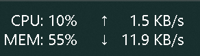

# Traffic Monitor

> [!NOTE]
> ⚡ **Vibe Coding 项目**
>
> 🚀 **Powered** by `deepseek v4 pro` & `mimo 2.5 pro`
>
> ✅ **Code Reviewed** by `qcode` & `Gemini 3.5 Flash`

Windows 任务栏系统监控小组件，实时显示 CPU、内存、网速信息。纯 Rust 实现，无配置文件，轻量高效。

## 下载

前往 [Releases](https://github.com/a145789/traffic-monitor/releases) 页面下载最新版本：

- **TrafficMonitor-Setup-x.x.x.exe**：安装包（推荐）
- **traffic-monitor.exe**：绿色版（无需安装，双击运行）

## 安装

### 安装包方式（推荐）

1. 双击运行 `TrafficMonitor-Setup-x.x.x.exe`
2. 按提示完成安装（需要管理员权限）
3. 程序会自动启动并嵌入任务栏

### 绿色版方式

1. 下载 `traffic-monitor.exe`
2. 双击运行即可
3. 如需开机自启，右键托盘图标 → 勾选「开机自启」

## 功能

- **CPU 使用率**：实时显示 CPU 占用百分比（5 秒刷新）
- **内存使用率**：显示当前内存占用
- **网速监控**：显示上传/下载速度（自动适配单位，1 秒刷新）
- **鼠标信息**（可选）：显示鼠标电量和 DPI（需连接支持的鼠标）
- **自动更新**：启动时自动检查新版本，也可手动检查
- **主题自适应**：自动跟随系统深色/浅色主题
- **智能省电**：全屏应用、睡眠、锁屏、显示器关闭时自动暂停

## 使用说明

程序启动后会自动嵌入 Windows 任务栏系统托盘左侧，以双行文字显示系统信息。

### 托盘菜单

右键系统托盘图标可打开菜单：

- **开机自启**：勾选后开机自动运行
- **自动检查更新**：勾选后启动时自动检查新版本
- **检查更新...**：手动检查是否有新版本
- **显示鼠标信息**：勾选后显示鼠标电量/DPI（需连接支持的鼠标）
- **重置鼠标**：鼠标连接异常时重新初始化（仅鼠标信息显示时可见）
- **退出**：关闭程序

### 命令行参数

- `traffic-monitor.exe --quit`：退出已运行的实例

### 智能省电

以下情况程序会自动暂停以节省资源：

- 全屏游戏/应用运行时（仅当全屏窗口与任务栏在同一显示器时触发）
- 电脑进入睡眠模式
- 显示器关闭（Modern Standby）
- 锁屏时

恢复正常后会自动恢复监控。

## 卸载

### 安装包安装的

通过 Windows 设置 → 应用 → 找到 Traffic Monitor → 卸载

### 绿色版

直接删除 `traffic-monitor.exe` 文件即可

## 系统要求

- Windows 10/11 64 位
- 管理员权限（安装时需要）
