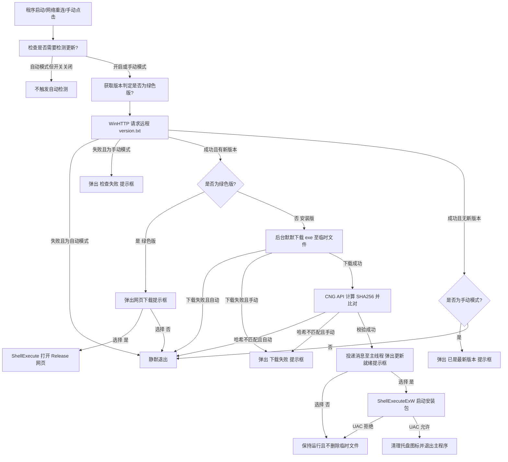

# RFC 0006: 自动更新设计 (更新版)

- **状态**: Draft (草案)
- **创建时间**: 2026-06-09
- **关联文件**: [main.rs](file:///D:/work_space/life/traffic-monitor/src/main.rs), [Cargo.toml](file:///D:/work_space/life/traffic-monitor/Cargo.toml), [installer.iss](file:///D:/work_space/life/traffic-monitor/installer.iss), [config.rs](file:///D:/work_space/life/traffic-monitor/src/config.rs), [tray.rs](file:///D:/work_space/life/traffic-monitor/src/tray.rs)

---

## 1. 背景与目标 (Context & Objectives)

为了提升用户体验并确保用户能够及时使用到最新的功能和 Bug 修复，本项目需要引入一种自动更新机制。更新过程需要满足以下核心设计原则：

- **轻量与好用权衡**：不引入臃肿的第三方依赖，完全利用 Windows 自带的 WinHTTP API 和 CNG 密码学 API，以维持本软件极致精简的二进制体积（符合 `opt-level="z"`）。
- **无感与防打扰**：
  - 后台自动检测：默认在网络连通时在后台进行一次检测，若无更新或检测失败则静默退出，决不打扰用户。
  - 后台无感下载：检测到新版本后在后台静默下载并完成校验，下载期间不提供任何卡顿的进度条，等更新包本地就绪后才弹出一次提示框。
- **用户自主控制**：
  - 提供自动更新开关（默认为开启，可通过注册表持久化状态）。
  - 提供手动检查更新选项，并带有明确的成功/失败弹窗反馈。
- **区分安装版与绿色版**：
  - **安装版**：支持全自动静默下载安装。
  - **绿色免安装版**：仅弹窗提醒并支持一键打开 GitHub Release 网页下载，尊重免安装用户的自主管理习惯。
- **安全可靠**：下载的安装包必须通过 SHA256 哈希校验（忽略大小写），防范中间人攻击（MITM）。
- **优雅退出与静默覆盖**：提权启动安装包成功后优雅清理托盘图标并退出主程序，避免强制杀进程引起的托盘区死图标残留。

---

## 2. 核心设计细节

### 2.1 版本定义文件与 URL 推导

- **版本文件 URL**：
  `https://raw.githubusercontent.com/a145789/traffic-monitor/main/assets/version.txt`
- **版本文件格式**（纯文本，每行一个字段）：
  ```text
  0.4.3
  <SHA256_HASH_OF_INSTALLER_HEX>
  ```
  第一行为最新版本号（Semantic Versioning），第二行为该版本安装包的 SHA256 十六进制哈希值。
- **安装包下载 URL 推导**：
  `https://github.com/a145789/traffic-monitor/releases/download/v{VERSION}/traffic-monitor-setup.exe`
  其中 `{VERSION}` 由版本文件第一行解析得到。
- **GitHub Release 网页 URL**：
  `https://github.com/a145789/traffic-monitor/releases`

### 2.2 安装版与绿色版的判定逻辑

程序通过检查自身同级目录下是否存在由 Inno Setup 自动生成的卸载程序来区分：

- **判定方法**：获取当前运行程序的所在目录，检查该目录下是否存在 `unins000.exe`。
  - 若**存在** `unins000.exe`，判定为**安装版**。
  - 若**不存在** `unins000.exe`，判定为**绿色免安装版**。

### 2.3 自动更新开关与状态持久化

- **注册表项**：使用 Windows 注册表保存用户的开关状态。
  - **注册表路径**：`HKCU\Software\Traffic Monitor`
  - **值名**：`EnableAutoUpdate` (DWORD)
  - **值含义**：`1` 表示开启（默认），`0` 表示关闭。
  - 若注册表中不存在此项，代码加载时应默认判定为 `true` (开启)。

### 2.4 托盘菜单集成

在系统托盘右键菜单中加入以下两项：

1. **自动检查更新** (MENU_ID_AUTO_UPDATE_TOGGLE = 1005)：
   - 显示复选勾（MFS_CHECKED / MFS_UNCHECKED）。
   - 点击时切换 `EnableAutoUpdate` 注册表值与内存中的原子状态。
2. **检查更新...** (MENU_ID_CHECK_UPDATE_MANUAL = 1006)：
   - 点击后强制在后台启动更新检测线程（即使自动更新开关被关闭）。
   - 该检测线程被标记为“手动触发（`is_manual = true`）”。

### 2.5 手动检查与后台自动检查的交互差异

| 运行版本   | 触发场景     | 更新状态                     | 交互表现                                                                                                      |
| :--------- | :----------- | :--------------------------- | :------------------------------------------------------------------------------------------------------------ |
| **通用**   | **自动检查** | 无更新 / 检测失败 / 校验失败 | **完全静默**，不弹出任何弹窗，主程序无感运行。                                                                |
| **安装版** | **自动检查** | 检测到更新并校验通过         | **下载并校验成功后弹窗**：“新版本 vX.Y.Z 已准备就绪。是否立即关闭程序并安装？”。                              |
| **绿色版** | **自动检查** | 检测到新版本                 | **直接弹窗提示**：“发现新版本 vX.Y.Z。是否打开网页下载免安装版？”。点击“是”用浏览器打开 GitHub Release 网页。 |
| **通用**   | **手动检查** | 已经是最新版本               | **弹窗提示**：“当前已是最新版本 (vA.B.C)。”                                                                   |
| **通用**   | **手动检查** | 网络超时 / 检测失败          | **弹窗提示**：“检查更新失败，请检查网络连接。”                                                                |
| **安装版** | **手动检查** | 检测到更新并校验通过         | **下载并校验成功后弹窗**：“新版本 vX.Y.Z 已准备就绪。是否立即关闭程序并安装？”。                              |
| **绿色版** | **手动检查** | 检测到新版本                 | **直接弹窗提示**：“发现新版本 vX.Y.Z。是否打开网页下载免安装版？”。点击“是”用浏览器打开网页。                 |

### 2.6 优雅拉起与自清理机制 (仅限安装版)

1. **UAC 处理**：通过 `ShellExecuteExW` 拉起临时安装包，若用户在 UAC 提权中点击“否”（拒绝），主程序捕获 `ERROR_CANCELLED` 错误后**保持运行**，不退出。
2. **优雅自尽**：若 UAC 成功通过，主程序先调用 `remove_tray_icon` 清理托盘，再使用 `PostQuitMessage(0)` 退出，腾出文件锁定并防止残留死图标。
3. **延迟自清理**：新版程序启动时，在后台线程中延迟 3 秒尝试检测并删除系统临时目录下的 `traffic-monitor-setup-temp.exe`。

---

## 3. 核心工作流流程图



---

## 4. 测试与验证策略 (Testing & Verification)

### 4.1 单元测试 (`cargo test`)

对于更新模块中的核心计算逻辑，必须编写轻量的单元测试。以下部分需要实现全自动单元测试：

- **版本比对逻辑**：
  - 测试基础版本比对功能（如 `"0.4.3" > "0.4.2"`, `"0.4.2" == "0.4.2"`, `"0.4.1" < "0.4.2"`）。
  - 测试格式不规整或带后缀的版本解析（如 `"0.4.2-nightly"` 等）。
- **哈希十六进制校验逻辑**：
  - 测试计算所得字节数组与十六进制字符串的转化。
  - 测试对哈希串大小写不敏感的匹配函数（如 `"A1B2"` 能正确匹配 `"a1b2"`）。
